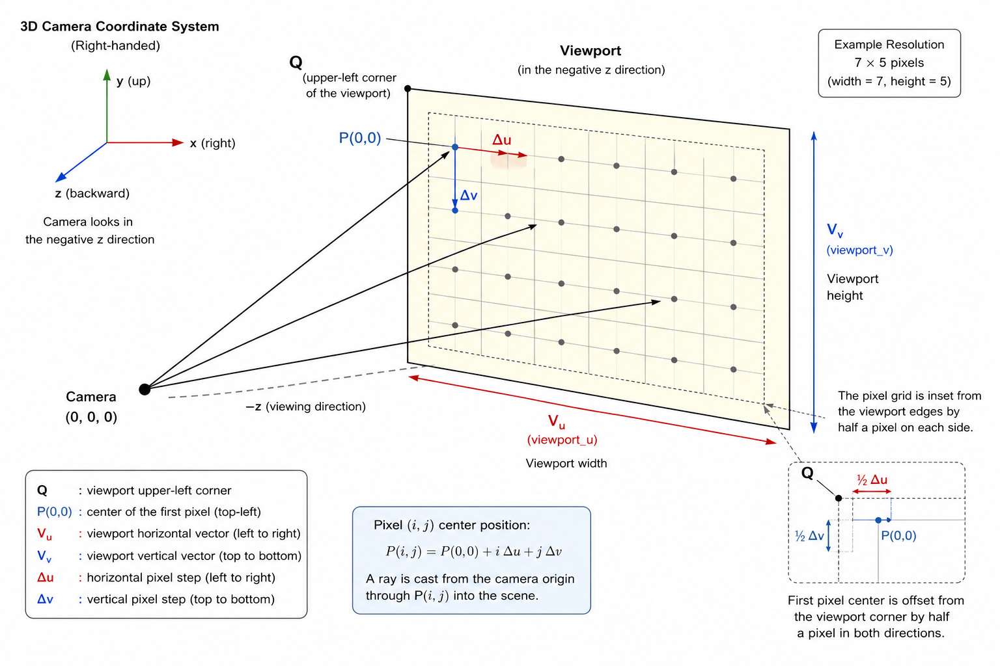

# RayTracer

A small C++20 ray tracing starter project built with CMake.

This project implements a basic ray tracer following the "Ray Tracing in One Weekend" series concepts, but with some modifications

## NOTICE
- This project is currently under development.
